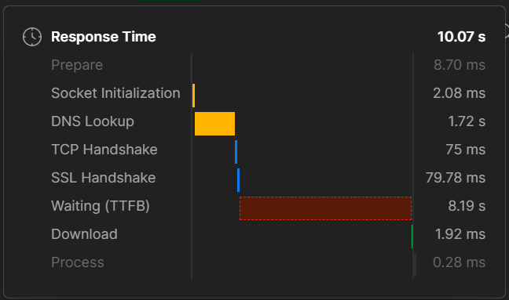
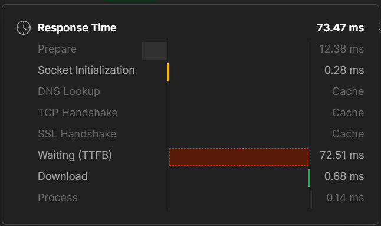
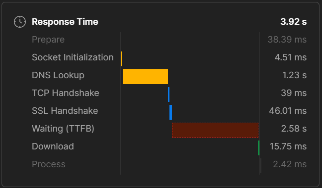
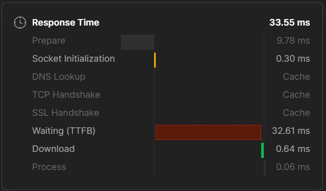

# Letterboxd API

A simple FastAPI-based wrapper around the letterboxdpy library, exposing a handful of endpoints to fetch Letterboxd user data as JSON. Packaged with Docker for easy multi-architecture deployment.

## 📦 Features

#### **1) User Info `GET /user/{username}`**


Example: `http://127.0.0.1:6996/user/saisamarth`

<details>
  <summary>Click to view JSON Responce</summary>

```
{
  "username": "saisamarth",
  "watchlist_length": "125",
  "favorites": [
    [
      "Mulholland Drive",
      "mulholland-drive"
    ],
    [
      "Heat",
      "heat-1995"
    ],
    [
      "Nightcrawler",
      "nightcrawler"
    ],
    [
      "A Bronx Tale",
      "a-bronx-tale"
    ]
  ],
  "stats": {
    "Films": "380",
    "This year": "21",
    "Lists": "8",
    "Following": "7",
    "Followers": "8"
  }
}
```

Returns basic profile data (watchlist length, favorites, stats).

</details>

#### **2) Following `GET /user/{username}/following`**

Example: `http://127.0.0.1:6996/user/saisamarth/following`

<details>
  <summary>Click to view JSON Responce</summary>


```
{
  "following": [
    "korosuke",
    "BhimaMalgi",
    "Guruprasad Pattar",
    "jagadeesh11",
    "capncook08",
    "OmBevin",
    "Vinay07"
  ]
}
```

Returns a list of usernames that the user is following.

</details>

#### **3) Followers `GET /user/{username}/followers`**

Example: `http://127.0.0.1:8000/user/saisamarth/followers`

<details>
  <summary>Click to view JSON Responce</summary>

```
{
  "followers": [
    "DeepakBaligar",
    "BhimaMalgi",
    "bott89",
    "Guruprasad Pattar",
    "jagadeesh11",
    "capncook08",
    "OmBevin",
    "Vinay07"
  ]
}
```

Returns a list of usernames who follow the user.

</details>

#### **4) Films `GET /user/{username}/films`**

Example: `http://127.0.0.1:8000/user/saisamarth/films`

<details>
  <summary>Click to view JSON Responce</summary>

```
{
  "films": [
    [
      "Thunderbolts*",
      "thunderbolts"
    ],
    [
      "Mickey 17",
      "mickey-17"
    ],
        [
      "The Godfather",
      "the-godfather"
    ]
  ]
}
```

Returns an array of (title, slug) pairs for all watched films.

All endpoints run on port 6996 by default.

</details>

## 🔥 Redis Caching

To drastically reduce scraping latency and load:

#### **Why Redis?** 
An in-memory key–value store with built-in TTL eviction—perfect for caching JSON responses without a schema or disk I/O overhead.

#### **How implemented?**

1. Connect to Redis via `redis.from_url(REDIS_URL)` in `app.py`.

2. Wrap each endpoint in a `cached(key, ttl, fetch_fn)` helper:

- `cache.get(key)` returns existing JSON, avoiding a scrape.

- On miss, call `fetch_fn()` (the slow Letterboxd scrape), then `cache.set(key, json, ex=ttl)`.

3. Default TTL is 300s (5 minutes), configurable per-endpoint.

#### **Results**

| Change                                                 | Before        | After        | 
| ------------------------------------------------------ | ------------- | ------------ |
| Response time reduced from **10.07 s** to **73.47 ms** **->** **99.27% incerase**  |  | |
| Response time reduced from **3.92 s** to **33.55 ms** **->** **99.14% incerase** |  |  |


## ⚙️ Quickstart

#### **1) Clone the repo:**

```
git clone https://github.com/saisamarth21/letterboxd-api.git
cd letterboxd-api
```

#### **2) Requirements (in `requirements.txt`):**

```
fastapi
uvicorn[standard]
letterboxdpy
requests
beautifulsoup4
lxml
redis>=4.5.0
```

#### **3) Run locally (requires Python 3.8+):**

```
python -m uvicorn app:app --host 0.0.0.0 --port 6996 --reload
```

- Swagger UI: http://localhost:6996/docs

- ReDoc: http://localhost:6996/redoc


## 🐳 Docker


#### **1) Dockerfile**

<details>
  <summary>Click to view</summary>

```
# syntax=docker/dockerfile:1
FROM --platform=$BUILDPLATFORM python:3.11-slim

# Create app directory
WORKDIR /app

# Install runtime dependencies
COPY requirements.txt .
RUN pip install --no-cache-dir -r requirements.txt

# Copy source
COPY . .

# Expose the port your FastAPI app uses
EXPOSE 6996

# Default command
CMD ["uvicorn", "app:app", "--host", "0.0.0.0", "--port", "6996"]
```

</details>

#### **2) Build & Push Multi-Arch Image**

```bash
# enable buildx once
docker buildx create --name multiarch --use

# if already enabled buildx 
docker buildx use multiarch

# build & push for amd64, arm64, arm/v7

docker buildx build \
  --platform linux/amd64,linux/arm64,linux/arm/v7 \
  -t <username>/letterboxd-api:latest \
  --push \
  .
```

#### **3) docker-compose.yml**

```yml
version: "3.8"

services:
  redis:
    container_name: redis
    image: redis:7-alpine
    command: ["redis-server", "--save", "", "--appendonly", "no"]
    ports:
      - "6379:6379"
    restart: unless-stopped

  letterboxd-api:
    container_name: letterboxd-api
    image: saisamarth21/letterboxd-api:redis1.3
    ports:
      - "6996:6996"
    environment:
      REDIS_URL: "redis://redis:6379/0"
    depends_on:
      - redis
    restart: unless-stopped
```


#### **4) docker-compose.yml**

```bash
docker-compose up -d
```
Your API will now be accessible on port 6996 of the host machine.

## 🛠️ License & Contributing

Feel free to open issues or PRs in the GitHub repo. Enjoy!
